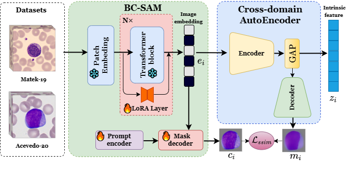
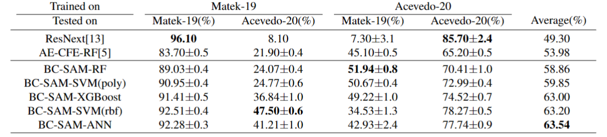

# BC-SAM
Official PyTorch implementation of Towards Cross-Domain Single Blood Cell Image Classification via Large-Scale LoRA-based Segment Anything Model (ISBI 2024).

<p align="center">
    
</p>

## Dataset
We use two different white blood cells datasets to evaluate our method:
<ul>
  <li> 
    The <strong>Matek-19</strong> dataset consists of over 18,000 annotated white blood cells from 100 acute myeloid leukameia patients. It is published by Matek et al. <a href="https://www.nature.com/articles/s42256-019-0101-9">Human-level recognition of blast cells in acute myeloid leukaemia with convolutional neural networks.</a>
  </li>
  <li>
    The <strong>Acevedo-20</strong> dataset has over 17,000 images which is published by Acevedo et al. <a href="https://www.data-in-brief.com/article/S2352-3409(20)30368-1/fulltext">A dataset of microscopic peripheral blood cell images for the development of automatic recognition systems.</a>
  </li>

</ul>

## Result
<p align="center">
    
</p>

## Usage
### Installation
```sh
cd BC-SAM
conda create -n BCSAM python=3.9
conda activate BCSAM
pip install torch==2.0.1+cu118 torchvision==0.15.2+cu118 --index-url https://download.pytorch.org/whl/cu118
pip install -r requirements.txt
```

### How to run
#### step 1 : Finetune Segment anything with LoRA
##### Finetune Data
[Train](https://drive.google.com/file/d/15dCR4xUut0CXYG-_4p5ZZhp6AXXZDAZt/view?usp=sharing) | [Test](https://drive.google.com/file/d/1MOK_IWlau5NiwQoAiLRzpusr4H1qX6y-/view?usp=sharing) 
```sh
├── SAM
    ├── datasets
        ├── Bloodcell
            ├── Bloodcell_train.dat.gz
            ├── Bloodcell_test.dat.gz
```
```sh
python SAM/finetune_main.py \
--checkpoint model/sam_vit_b_01ec64.pth \
--datasets_dir SAM/datasets/Bloodcell \
--exit_path SAM/output
```

#### step 2 : Get image embeddings and masks
Matek-19
```sh
python SAM/sam_output.py
--path /path/to/dataset/Matek-19
--checkpoint_sam model/sam_vit_b_01ec64.pth
--checkpoint_path SAM/output/epoch_85.pth
--file_ext SAM/Matek-19.dat.gz
```

Acevedo-20
```sh
python SAM/sam_output.py
--path /path/to/dataset/Acevedo-20
--checkpoint_sam model/sam_vit_b_01ec64.pth
--checkpoint_path SAM/output/epoch_85.pth
--file_ext SAM/Acevedo-20.dat.gz
```
Here, `--path` is the path of the source dataset.

#### step 3 : Train Cross-domain Autoencode
```sh
python train.py \
--datasets_dir SAM
--model_exit model/
```
Here, `--datasets_dir` is the path of features and masks extracted from SAM.

#### step 4 : Classification
Run feature/classification.ipynb to get the classification results.

